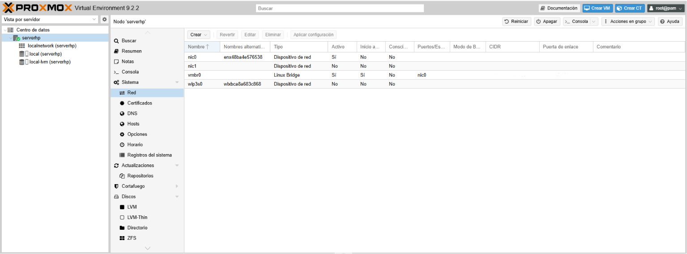
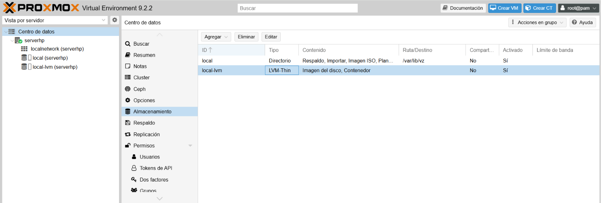
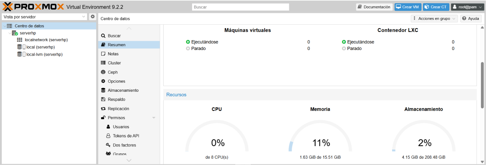

# Infraestructura base - Proxmox VE

## Objetivo
Instalación y configuración inicial de Proxmox VE sobre un portátil, para su uso 
como host de virtualización en el laboratorio, con acceso remoto a la interfaz 
web desde un segundo equipo.

## Hardware del host
- Equipo: portátil (nodo `serverhp`)
- CPU: 8 núcleos
- RAM: 15.51 GiB
- Almacenamiento: 208.48 GiB

## Configuración de red inicial
- Interfaces detectadas: `nic0`, `nic1` (Ethernet), `wlp3s0` (WiFi)
- Bridge `vmbr0` configurado sobre la interfaz física, con IP estática `192.168.100.2/24`
- Esta es la red de gestión del host y la que da acceso a la interfaz web de Proxmox

## Almacenamiento
Configuración por defecto de Proxmox:
- **local**: tipo Directorio (`/var/lib/vz`), usado para ISOs, backups y plantillas
- **local-lvm**: tipo LVM-Thin, usado para discos de máquinas virtuales y contenedores

## Estado de recursos
Vista general del nodo en el momento de la documentación: uso de CPU, memoria y 
almacenamiento, junto con el estado del nodo.

## Acceso remoto
Se accede a la interfaz web de Proxmox (puerto 8006) desde un segundo equipo 
conectado a la misma red doméstica, sin necesidad de configuración adicional 
más allá de la IP del host.

## Próximos pasos
- Creación de una red interna virtual (`vmbr1`) con NAT, para aislar las 
  máquinas virtuales del laboratorio de la red doméstica principal
- Despliegue de Windows Server 2025 con Active Directory y DHCP
