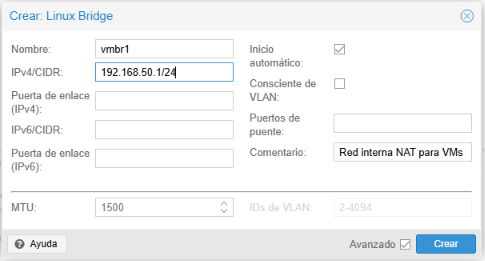
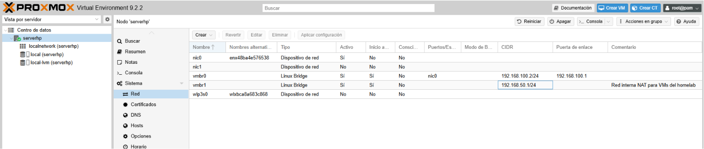
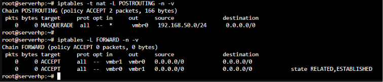

# Red interna virtual con NAT (Proxmox)

## Objetivo
Crear una red interna aislada dentro de Proxmox VE para las máquinas virtuales 
del laboratorio, con salida a internet mediante NAT, evitando así conflictos 
con la red doméstica (especialmente de cara a que el futuro Controlador de 
Dominio actúe también como servidor DHCP sin interferir con el router).

## Por qué esta decisión
Inicialmente se planteó usar la red doméstica directamente (`vmbr0`, rango 
`192.168.100.0/24`) con IPs fijas para las VMs. Al decidir que el Controlador 
de Dominio también actuaría como servidor DHCP, se optó por crear una red 
interna separada (`vmbr1`) para evitar que coexistan dos servidores DHCP 
(router doméstico + DC) en la misma red, siguiendo una práctica habitual en 
entornos corporativos de separar la red de dominio de otras redes.

Se eligió el rango `192.168.50.0/24` para `vmbr1`, distinto al de `vmbr0` 
(`192.168.100.0/24`), para evitar cualquier solapamiento o conflicto de 
enrutamiento entre ambas redes.

## Arquitectura

```
Router doméstico (192.168.100.0/24)
   └── vmbr0 (Proxmox) — 192.168.100.2 — conexión a internet

Host Proxmox (serverhp)
   └── vmbr1 (red interna NAT, 192.168.50.0/24) — gateway 192.168.50.1
         ├── DC01 - 192.168.50.10 (IP fija) [pendiente]
         └── PC01 - IP asignada por DHCP del DC [pendiente]
```

## Configuración realizada

### 1. Creación del bridge interno
- Bridge `vmbr1` creado en Centro de datos → serverhp → Sistema → Red
- Dirección IPv4/CIDR: `192.168.50.1/24`
- Sin puertos físicos asociados (bridge ports vacío) → red aislada de la LAN doméstica
- Autostart activado





### 2. Activación de IP forwarding
En la consola del host Proxmox:
```bash
echo "net.ipv4.ip_forward=1" >> /etc/sysctl.conf
sysctl -p
```

### 3. Reglas NAT (masquerade)
```bash
iptables -t nat -A POSTROUTING -s 192.168.50.0/24 -o vmbr0 -j MASQUERADE
iptables -A FORWARD -i vmbr1 -o vmbr0 -j ACCEPT
iptables -A FORWARD -i vmbr0 -o vmbr1 -m state --state RELATED,ESTABLISHED -j ACCEPT
```

### 4. Persistencia de las reglas tras reinicio
```bash
apt install iptables-persistent
netfilter-persistent save
```




## Verificación

Se confirmó con `ip a` que ambos bridges están activos (estado UP) y correctamente configurados:
- `vmbr0`: 192.168.100.2/24 (salida a internet)
- `vmbr1`: 192.168.50.1/24 (red interna, sin interfaz física asociada)

Se verificaron las reglas aplicadas con:
```bash
iptables -t nat -L POSTROUTING -n -v
iptables -L FORWARD -n -v
```
Confirmando la regla MASQUERADE para la subred 192.168.50.0/24 y las reglas 
de reenvío (FORWARD) entre `vmbr1` y `vmbr0` en ambos sentidos.

**Pendiente**: verificación de conectividad real (ping a internet) desde una 
VM conectada a `vmbr1`, se realizará al desplegar la VM del Controlador de 
Dominio en el siguiente proyecto.

## Problemas encontrados
[Rellenar con cualquier incidencia real durante el proceso: por ejemplo, si 
tuviste que revisar el nombre exacto de la interfaz física para el NAT, algún 
error de sintaxis, etc.]

## Próximos pasos
- Despliegue de la VM con Windows Server 2025 sobre esta red (`vmbr1`)
- Instalación de AD DS, DNS y DHCP
- Conexión de un cliente Windows recibiendo IP por DHCP desde el DC
