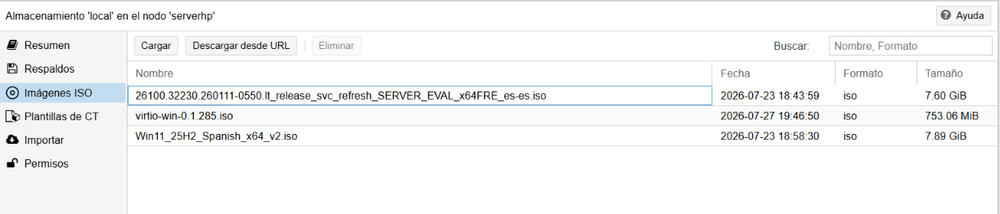
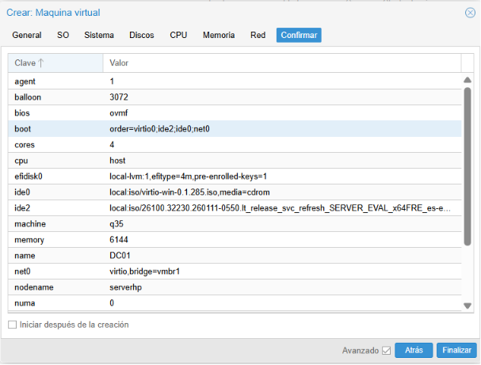
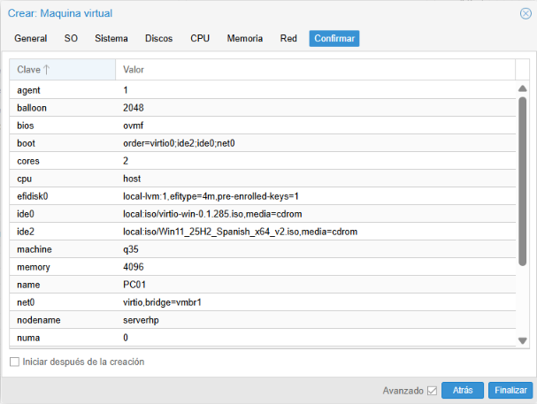
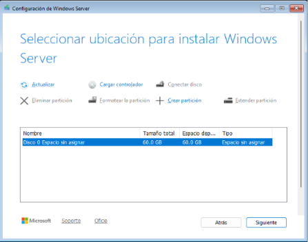
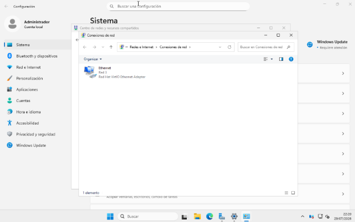
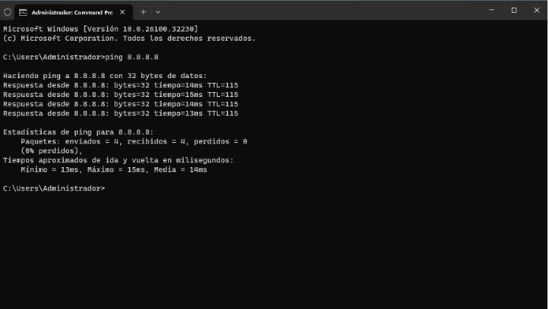

# Creación de máquinas virtuales - DC01 y PC01

## Objetivo
Desplegar dos máquinas virtuales sobre Proxmox VE, conectadas a la red interna 
`vmbr1` creada previamente: un servidor con Windows Server 2025 (futuro 
Controlador de Dominio) y un cliente con Windows 11, que se unirá al dominio 
en un proyecto posterior. Este documento cubre desde la creación de ambas VMs 
hasta dejar `DC01` con Windows Server instalado, red funcionando y 
conectividad a internet verificada.

## Reparto de recursos

| VM | vCPU | RAM | Disco | Red |
|---|---|---|---|---|
| DC01 (Windows Server 2025) | 4 | 6 GB (mín. 3 GB ballooning) | 60 GB | vmbr1 |
| PC01 (Windows 11) | 2 | 4 GB (mín. 2 GB ballooning) | 64 GB | vmbr1 |

Reparto ajustado a los recursos del host (8 CPU / 15.51 GiB RAM / 208 GiB 
almacenamiento), dejando margen para el propio Proxmox.

## Preparación previa

### ISOs utilizadas
- **Windows Server 2025** (evaluación, 180 días) - Centro de evaluación de Microsoft
- **Windows 11** - página oficial de descarga de Microsoft
- **virtio-win.iso** - drivers VirtIO para disco, red y Guest Tools, descargado 
  desde el repositorio oficial: `fedorapeople.org/groups/virt/virtio-win/direct-downloads/stable-virtio/`

Subidas a Proxmox en: Centro de datos → serverhp → local (storage) → ISO Images



## Creación de DC01 (Windows Server 2025)

### Configuración de la VM
- **General**: Nombre `DC01`
- **OS**: ISO Windows Server 2025, tipo Microsoft Windows, versión 11/2022/2025, 
  con disco adicional de drivers VirtIO (`virtio-win.iso`)
- **Sistema**: BIOS OVMF (UEFI), Almacenamiento EFI en `local-lvm` con claves 
  pre-inscritas, QEMU Agent activado, controlador SCSI VirtIO SCSI single
- **Discos**: 60 GB, bus VirtIO Block, storage `local-lvm`, formato raw, IO thread activado
- **CPU**: 4 núcleos, tipo `host`
- **Memoria**: 6144 MiB, ballooning activado (mínimo 3072 MiB)
- **Red**: bridge `vmbr1`, modelo VirtIO



## Creación de PC01 (Windows 11)

### Configuración de la VM
Misma base que DC01, con las siguientes diferencias por los requisitos propios 
de Windows 11:
- **Sistema**: se añadió **TPM v2.0** (obligatorio para instalar Windows 11; 
  sin él, el instalador rechaza la instalación por no cumplir requisitos mínimos)
- **CPU**: 2 núcleos, tipo `host`
- **Memoria**: 4096 MiB, ballooning activado (mínimo 2048 MiB)
- **Discos**: 64 GB



## Instalación de Windows Server 2025 en DC01

### Edición seleccionada
**Windows Server 2025 Standard (Escritorio/Desktop Experience)**. Se descartó 
Datacenter por no necesitar sus funcionalidades (Storage Spaces Direct, 
Shielded VMs, clustering a gran escala), pensadas para infraestructuras con 
múltiples servidores físicos, no aplicables a un homelab de un único host. 
Se eligió la versión con interfaz gráfica (frente a Server Core) para 
facilitar la gestión y la documentación del proyecto.

### Selección de disco: driver VirtIO no incluido
Durante la instalación, el disco de 60 GB no aparecía disponible, ya que 
Windows no incluye de forma nativa el controlador VirtIO Block.

**Solución**: en la pantalla de selección de disco, se usó "Cargar controlador" 
→ se navegó hasta la unidad de `virtio-win.iso` → carpeta `viostor\2k22\amd64` 
(el controlador correspondiente a un disco configurado como VirtIO Block; si 
el disco se hubiera configurado como VirtIO SCSI, el driver correcto habría 
estado en `vioscsi` en su lugar). Tras cargarlo, el disco de 60 GB quedó 
visible y se completó la instalación con normalidad.



## Configuración de red en DC01

### Adaptador de red no detectado
Tras completar la instalación, la sección de conexiones de red aparecía vacía: 
tampoco el adaptador de red (VirtIO) viene soportado de forma nativa por Windows.

**Solución**: ya con Windows instalado, se ejecutó `virtio-win-gt-x64.exe` 
(Guest Tools) desde la unidad de `virtio-win.iso`, instalando de una vez todos 
los drivers necesarios (red, balloon, etc.) y el **QEMU Guest Agent**. Tras 
reiniciar, el adaptador "Red Hat VirtIO Ethernet Adapter" quedó disponible.



### IP estática asignada
```
Dirección IP: 192.168.50.10
Máscara de subred: 255.255.255.0
Puerta de enlace: 192.168.50.1
DNS (temporal, para pruebas): 8.8.8.8
```
El DNS se dejó apuntando temporalmente a un DNS público para poder verificar 
la salida a internet; se cambiará para apuntar a la propia IP del DC 
(192.168.50.10) al instalar el rol DNS junto con AD DS en el siguiente proyecto.

## Problemas encontrados y solución

**1. La VM intentaba arrancar por red (PXE) en vez de desde el CD**
- Causa: no se pulsó ninguna tecla a tiempo en el aviso "Press any key to boot from CD or DVD"
- Solución: reiniciar la VM y pulsar una tecla inmediatamente al ver el mensaje

**2. Disco no detectado durante la instalación**
- Causa: controlador VirtIO Block no incluido de forma nativa en Windows
- Solución: cargar manualmente el driver `viostor` desde `virtio-win.iso` durante el instalador

**3. Adaptador de red no detectado tras instalar Windows**
- Causa: mismo motivo, driver de red VirtIO no incluido de serie
- Solución: instalar el paquete completo de Guest Tools (`virtio-win-gt-x64.exe`)

**4. Sin salida a internet pese a tener IP y NAT correctamente configurados**
- Diagnóstico escalonado: ping desde la VM al gateway interno (192.168.50.1) 
  funcionaba, pero no había respuesta a internet. Se comprobó desde la consola 
  del host Proxmox: ping al gateway real (192.168.100.1, el segundo equipo con 
  ICS) funcionaba, pero ping a internet (8.8.8.8 / 1.1.1.1) devolvía 
  "Destination Host Unreachable"
- Causa: el ICS (Internet Connection Sharing) del segundo equipo, que 
  proporciona la salida a internet al host Proxmox, había dejado de enrutar 
  tráfico correctamente
- Solución: desactivar y reactivar la opción de "Compartir conexión a Internet" 
  en el adaptador WiFi del segundo equipo, regenerando así sus reglas de NAT internas
- Este incidente confirma además, de forma práctica, que la configuración de 
  red interna y NAT en Proxmox (proyecto `01-red-interna-nat`) funciona 
  correctamente de extremo a extremo

## Resultado final
- `DC01` y `PC01` creadas con la configuración de recursos definida
- Windows Server 2025 instalado en `DC01`, con red y conectividad a internet verificadas
- Verificación de conectividad completa: VM → vmbr1 → NAT (host Proxmox) → vmbr0 → ICS → internet



## Próximos pasos
- Instalación de AD DS y DNS en DC01, promoción a Controlador de Dominio
- Cambio de DNS de DC01 para apuntar a sí mismo (192.168.50.10)
- Instalación del rol DHCP y configuración del ámbito para la red 192.168.50.0/24
- Instalación de Windows 11 en PC01 y unión al dominio recibiendo IP por DHCP
## Próximos pasos
- Instalación de AD DS y DNS en DC01, promoción a Controlador de Dominio
- Cambio de DNS de DC01 para apuntar a sí mismo (192.168.50.10)
- Instalación del rol DHCP y configuración del ámbito para la red 192.168.50.0/24
- Instalación de Windows 11 en PC01 y unión al dominio recibiendo IP por DHCP
