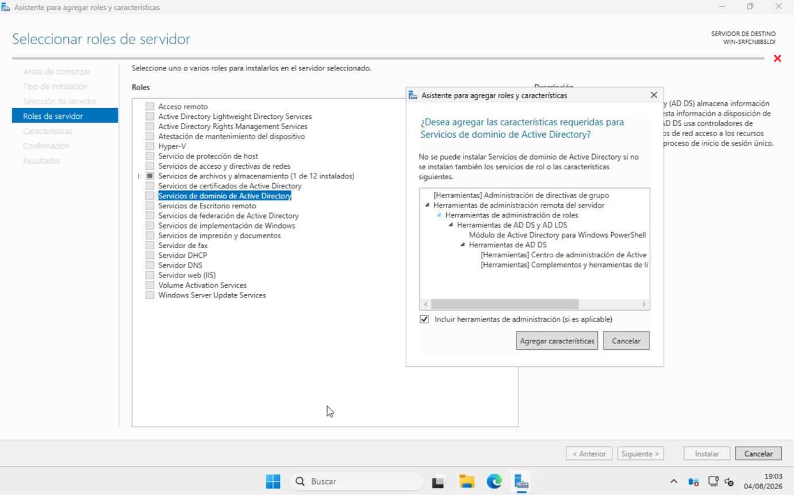
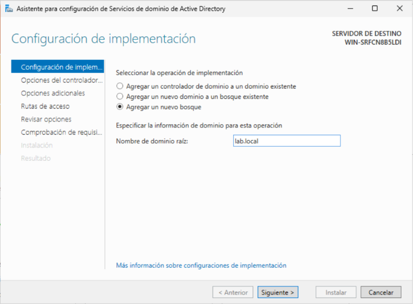
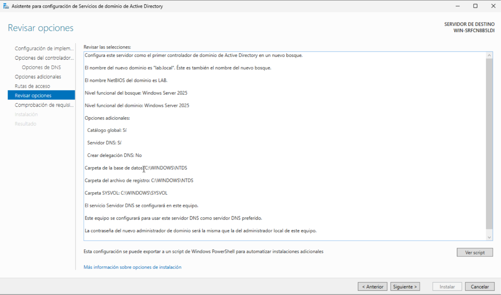
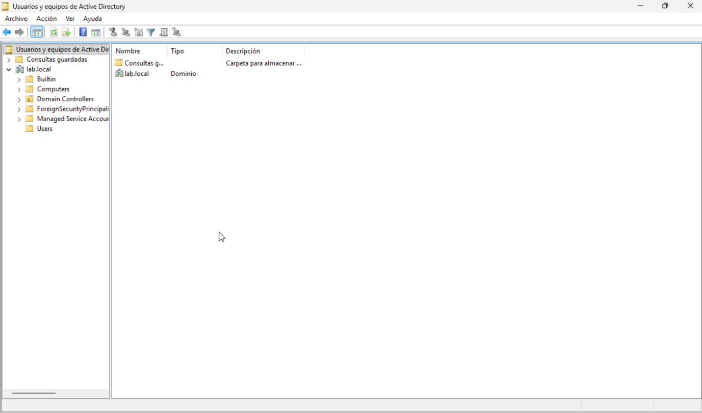
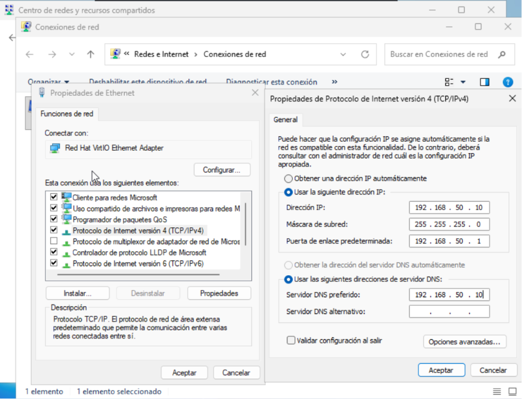
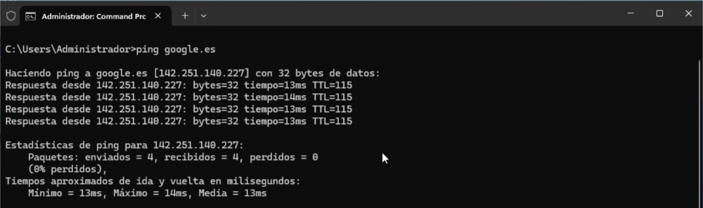
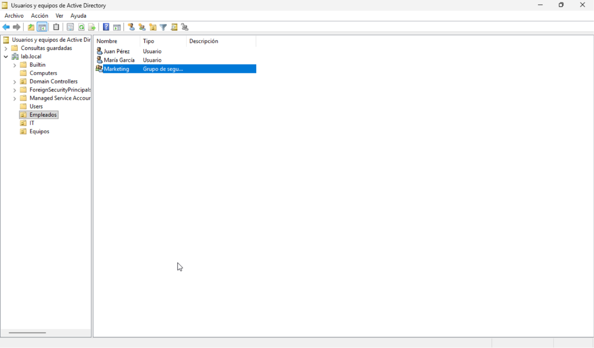
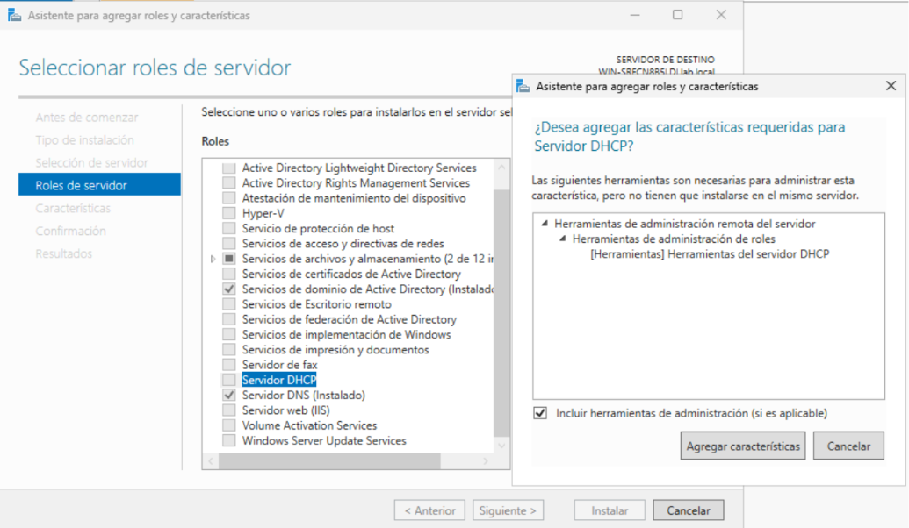
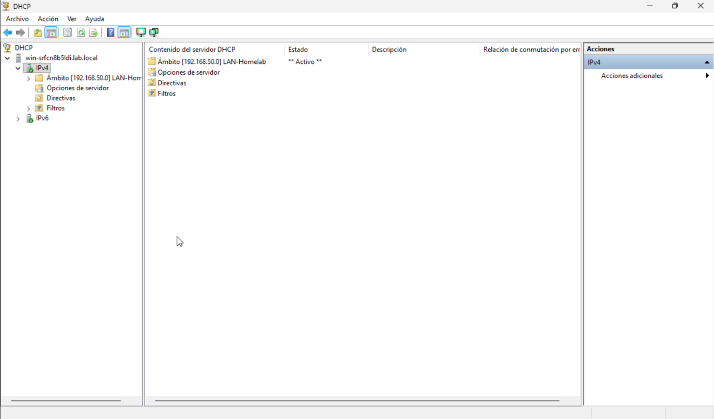

# Active Directory (AD DS) y DHCP en DC01

## Objetivos
Convertir el servidor `DC01` (Windows Server 2025) en un Controlador de Dominio 
funcional, con Active Directory Domain Services (AD DS), DNS propio, una 
estructura básica de Unidades Organizativas, usuarios y grupos, y servicio 
DHCP para repartir IPs automáticamente a los futuros clientes de la red 
interna `vmbr1`.

## Arquitectura resultante

```
Dominio: lab.local
Controlador de Dominio: DC01 (192.168.50.10)
  - AD DS + DNS + DHCP

Red interna (vmbr1 - 192.168.50.0/24)
  - Rango DHCP: 192.168.50.50 - 192.168.50.150
  - Reservado (fuera de DHCP): 192.168.50.1 - 192.168.50.49 (gateway, DC, servidores fijos)
```

## Instalación del rol AD DS

Se instaló el rol **Servicios de dominio de Active Directory** desde el 
Administrador del servidor, junto con las herramientas de administración 
requeridas (Herramientas de administración de directivas de grupo, 
herramientas de AD DS y AD LDS).



## Promoción a Controlador de Dominio

Tras instalar el rol, se promovió el servidor a Controlador de Dominio 
mediante el asistente correspondiente:

- **Configuración de implementación**: Agregar un nuevo bosque
- **Nombre de dominio raíz**: `lab.local`
- **Nivel funcional del bosque y dominio**: el más alto disponible (Windows 
  Server 2025), al no existir otros DCs con los que mantener compatibilidad
- **Servidor de catálogo global**: activado (obligatorio en el primer DC del bosque)
- **Servidor DNS**: activado, instalado junto con AD DS para la resolución de 
  nombres interna del dominio
- **Contraseña de restauración de servicios de directorio (DSRM)**: configurada 
  como contraseña de emergencia independiente de las cuentas de dominio
- **Nombre NetBIOS**: generado automáticamente (`LAB`)
- Aviso de "no se pudo crear una delegación DNS" ignorado conscientemente, ya 
  que es un comportamiento esperado en un dominio `.local` sin DNS público 
  gestionando la delegación





El servidor se reinició automáticamente al finalizar la promoción.

## Verificación de la promoción

Tras el reinicio, se confirmó que el dominio se creó correctamente accediendo 
a **Usuarios y equipos de Active Directory**, donde aparece la estructura por 
defecto del dominio (`Builtin`, `Computers`, `Domain Controllers`, `Users`).



## Actualización del DNS de DC01

Con el rol DNS ya activo en el propio servidor, se actualizó la configuración 
de red del adaptador para que el DNS preferido apuntara a la propia IP del 
DC, en lugar del DNS público usado temporalmente durante las pruebas de 
conectividad del proyecto anterior:

```
DNS preferido (antes): 8.8.8.8
DNS preferido (después): 192.168.50.10
```



Se verificó que la resolución de nombres y la salida a internet seguían 
funcionando correctamente tras el cambio:

```
ping google.es
```
Resultado: resolución correcta a la IP pública de Google, con respuesta 
exitosa en los 4 paquetes enviados (latencia media ~14ms).



## Estructura de Active Directory

Se creó una estructura básica de Unidades Organizativas (OU), usuarios y un 
grupo de seguridad, para simular una organización real:

- **OUs creadas**: `Empleados`, `Equipos`, `IT` (con protección contra 
  eliminación accidental activada)
- **Usuarios de prueba**: creados dentro de la OU `Empleados`
- **Grupo de seguridad**: creado con ámbito Global y tipo Seguridad, con 
  usuarios de prueba añadidos como miembros



## Instalación y configuración del rol DHCP

### Instalación del rol
Se instaló el rol **Servidor DHCP** desde el Administrador del servidor, 
junto con las herramientas de administración correspondientes.



### Autorización en Active Directory
Tras la instalación, se completó la configuración post-implementación, 
autorizando el servidor DHCP en Active Directory (paso obligatorio en un 
entorno de dominio: un servidor DHCP no autorizado no puede repartir IPs, 
como medida de seguridad frente a servidores DHCP no controlados en la red).

### Creación del ámbito
Se creó un ámbito DHCP con la siguiente configuración:

```
Nombre: LAN-Homelab
Rango de direcciones: 192.168.50.50 - 192.168.50.150
Máscara de subred: 255.255.255.0
Puerta de enlace (router): 192.168.50.1
Dominio DNS: lab.local
Servidor DNS: 192.168.50.10
Duración de concesión: 8 días (por defecto)
Estado: activado
```

Se dejó el rango 192.168.50.1 - 192.168.50.49 fuera del ámbito DHCP, 
reservado para direcciones IP fijas (gateway, DC01, y futuros servidores).



## Problemas encontrados
No se encontraron incidencias relevantes durante esta configuración; el 
proceso de promoción a Controlador de Dominio y la configuración de DHCP 
se completaron sin errores, siguiendo el flujo estándar de los asistentes 
de Windows Server.

## Resultado final
- `DC01` operativo como Controlador de Dominio del dominio `lab.local`
- DNS propio funcionando, con resolución interna y externa verificada
- Estructura de OUs, usuarios y grupos creada
- Servicio DHCP autorizado y ámbito activo, listo para repartir IPs a 
  clientes en la red `192.168.50.0/24`

## Próximos pasos
- Instalación de Windows 11 en la VM `PC01`
- Verificación de que `PC01` recibe IP automáticamente desde el ámbito DHCP
- Unión de `PC01` al dominio `lab.local`
- Inicio de sesión en `PC01` con uno de los usuarios de dominio creados
