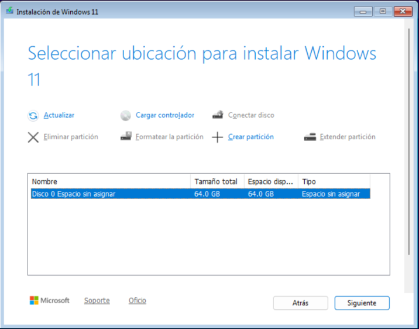
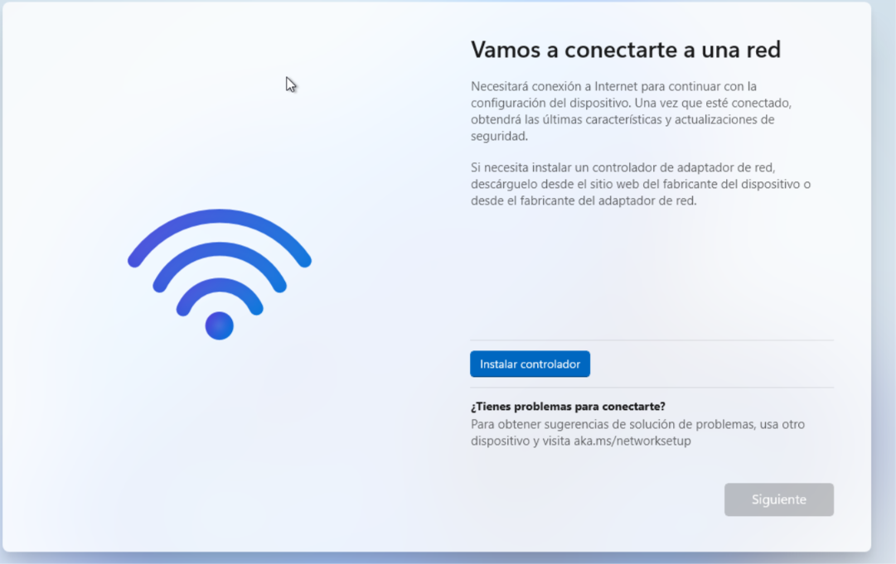
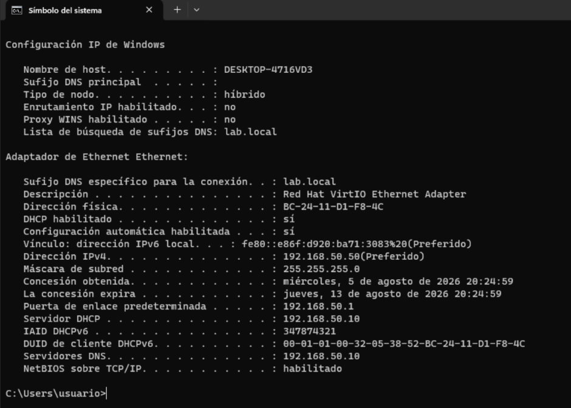
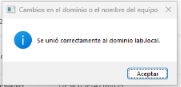
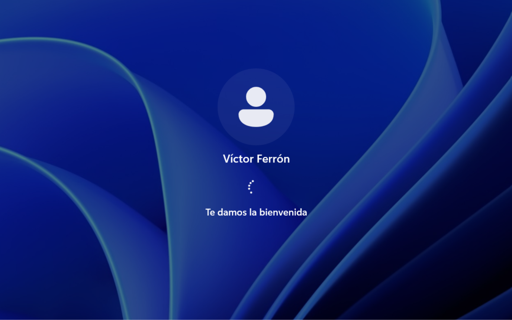
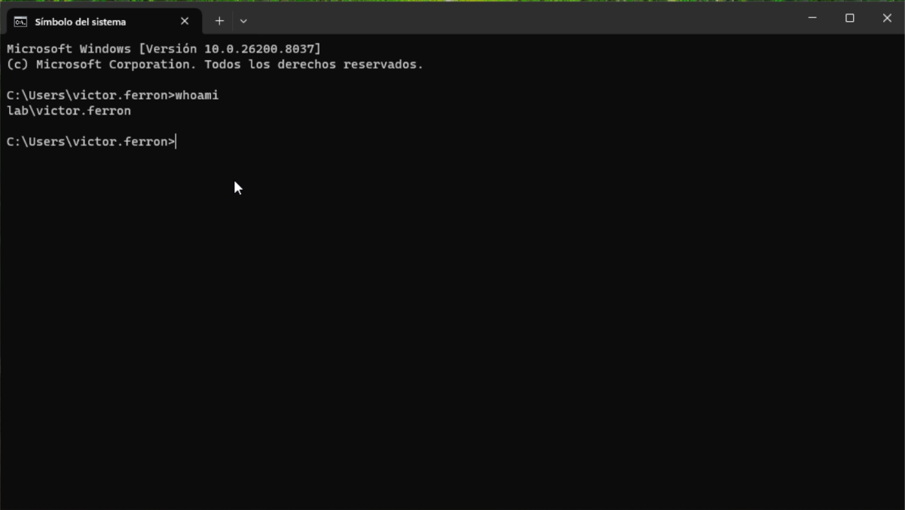

# Unión de cliente Windows 11 al dominio

## Objetivo
Instalar Windows 11 en la VM `PC01`, verificar que recibe configuración de 
red automáticamente mediante el servicio DHCP configurado en `DC01`, unirla 
al dominio `lab.local`, y confirmar el acceso con un usuario de Active 
Directory. Este proyecto cierra el ciclo completo del homelab, verificando 
de extremo a extremo que toda la infraestructura construida (red NAT, DHCP, 
AD DS) funciona correctamente con un cliente real.

## Arquitectura resultante

```
Dominio: lab.local
Controlador de Dominio: DC01 (192.168.50.10) - AD DS + DNS + DHCP

Cliente: PC01 (Windows 11)
  - Red: vmbr1
  - IP: asignada automáticamente por DHCP (192.168.50.50)
  - Estado: unido al dominio lab.local
```

## Instalación de Windows 11 en PC01

### Detección de disco (mismo problema que en DC01)
Durante la instalación, el disco de 64 GB no aparecía disponible, repitiendo 
el mismo problema visto al instalar Windows Server 2025 en DC01 (proyecto 
`02-creacion-vms`): el controlador VirtIO Block no viene incluido de forma 
nativa en el instalador de Windows.

**Solución**: se cargó el driver mediante "Cargar controlador" → unidad de 
`virtio-win.iso` → carpeta `viostor\w11\amd64` (equivalente a la carpeta 
`2k22` usada en Windows Server, pero específica para Windows 11). Tras 
cargarlo, el disco quedó visible y se completó la instalación con normalidad.



### Requisito de conexión a Internet obligatoria (OOBE)
A diferencia de Windows Server, la configuración inicial de Windows 11 
(OOBE) exige conexión a Internet obligatoria para continuar, y al no estar 
detectado el adaptador de red (mismo motivo: driver VirtIO no incluido de 
serie), el asistente quedó bloqueado en la pantalla de conexión a red.



**Solución**: se utilizó el atajo `Shift + F10` para abrir una consola desde 
el propio instalador, ejecutando el comando:
```
oobe\bypassnro
```
Esto reinicia el proceso de configuración y habilita la opción de continuar 
sin conexión ("configuración limitada"), permitiendo completar la instalación 
con una cuenta local. Ya con el escritorio disponible, se instalaron los 
drivers de red mediante Guest Tools (`virtio-win-gt-x64.exe`), quedando el 
adaptador de red funcionando con normalidad.

## Verificación de IP por DHCP

Con el adaptador de red ya funcionando, se comprobó mediante `ipconfig /all` 
que `PC01` recibió automáticamente una dirección IP del ámbito DHCP 
configurado en `DC01`, sin ninguna configuración manual:

```
Dirección IP: 192.168.50.50
Puerta de enlace predeterminada: 192.168.50.1
Servidores DNS: 192.168.50.10
```

La IP asignada corresponde a la primera disponible del rango configurado 
(`192.168.50.50` - `192.168.50.150`), confirmando que el servicio DHCP de 
`DC01` está operativo y respondiendo correctamente a las peticiones de la 
red interna.



## Unión al dominio

1. Configuración avanzada del sistema → pestaña Nombre de equipo → **Cambiar**
2. Se seleccionó **Dominio**, especificando `lab.local`
3. Se autenticó con una cuenta con permisos de administrador del dominio
4. El sistema confirmó la unión correctamente



Tras reiniciar el equipo, como es requerido tras unirse a un dominio, se 
verificó el acceso.

## Verificación de acceso con usuario de dominio

Se inició sesión en `PC01` utilizando uno de los usuarios de Active Directory 
creados previamente en `DC01` (proyecto `03-active-directory-dhcp`), en 
formato `LAB\usuario`.



Se confirmó mediante el comando `whoami` que la sesión iniciada corresponde 
a una cuenta de dominio y no a una cuenta local del equipo:

```
whoami
lab\nombreusuario
```



## Problemas encontrados y solución

**1. Disco no detectado durante la instalación**
- Causa: controlador VirtIO Block no incluido de forma nativa en Windows 11
- Solución: cargar manualmente el driver `viostor` desde `virtio-win.iso`, 
  carpeta específica `w11\amd64`

**2. Bloqueo en el asistente de configuración inicial (OOBE) por falta de red**
- Causa: Windows 11 exige conexión a Internet obligatoria durante la 
  configuración inicial, y el adaptador de red VirtIO no estaba detectado 
  en ese punto del proceso
- Solución: uso del comando `oobe\bypassnro` (accedido vía `Shift+F10`) para 
  omitir el requisito de conexión y completar la instalación con 
  configuración limitada; los drivers de red se instalaron después, ya con 
  el escritorio disponible

## Resultado final
- Windows 11 instalado y operativo en `PC01`
- Recepción automática de IP, gateway y DNS mediante el servicio DHCP de `DC01`
- Unión correcta al dominio `lab.local`
- Acceso verificado con un usuario de Active Directory, confirmando el 
  funcionamiento de extremo a extremo de toda la infraestructura: red interna 
  con NAT → DHCP → resolución DNS → autenticación de dominio

## Cierre del proyecto homelab
Con este último hito se completa el recorrido planteado desde el inicio del 
laboratorio: infraestructura base sobre Proxmox, red interna segmentada con 
NAT, despliegue de máquinas virtuales, Active Directory con DNS y DHCP, y un 
cliente real unido al dominio y autenticando correctamente. El conjunto 
demuestra un flujo de trabajo completo de administración de sistemas: 
virtualización, redes, sistemas operativos Windows Server y cliente, 
directorio activo, y resolución de incidencias reales documentadas a lo 
largo de todo el proceso.
